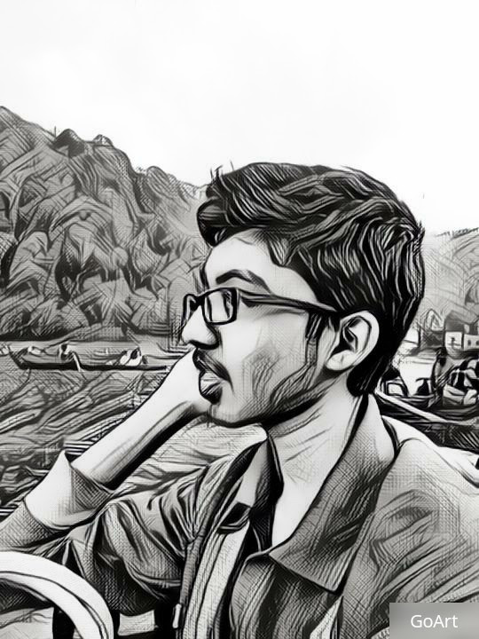

## About Me

Hi! I am a PhD student in the [GraphDeco](https://team.inria.fr/graphdeco/) group at INRIA Sophia-Antipolis with [Dr. George Drettakis](http://www-sop.inria.fr/members/George.Drettakis/) in the beautiful French Riviera.
My research revolves around light transport theory; specifically, I am interested in using optimization-based methods to improve rendering algorithms.
Check out my [publications](/publications) to learn more about my research.

I completed my Master's at [IIIT Hyderabad](https://iiit.ac.in), where I was supervised by [Dr. P. J. Narayanan](https://faculty.iiit.ac.in/~pjn/) and co-advised by [Dr. Adrien Gruson](https://profs.etsmtl.ca/agruson/) and [Dr. Luis Gamboa](https://lc.fie.umich.mx/~legg/).
I have previously worked as an intern at [IBM Research](https://research.ibm.com/labs/india/) and [Metabrainz Foundation](https://metabrainz.org/) (GSoC 2020).
Apart from my research interests, I love building well-designed, well-written, and helpful software systems.
Take a look at the [projects](/projects) page to find projects I've worked on.

In my free time, I like to bike, run, and hike!

## Links
- [E-Mail](mailto:ishaan.n.shah@gmail.com)
- [GitHub](https://github.com/ishaanshah)
- [LinkedIn](https://www.linkedin.com/in/ishaan-shah-57a1341a4/)
- [Google Scholar](https://scholar.google.com/citations?user=sTK3ob4AAAAJ&hl=en)
