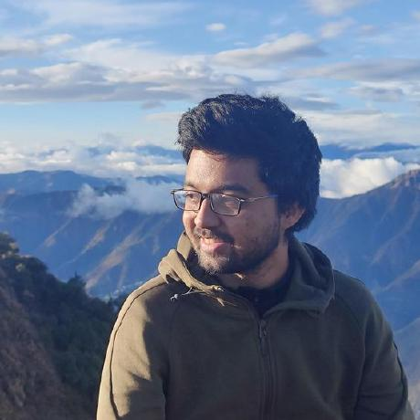

## About Me

Hi! I am a MS graduate from [IIIT Hyderabad](https://iiit.ac.in).
During my Master’s, I was supervised by [Dr. P. J. Narayanan](https://faculty.iiit.ac.in/~pjn/) and co-advised by [Dr. Adrien Gruson](https://profs.etsmtl.ca/agruson/) and [Dr. Luis Gamboa](https://lc.fie.umich.mx/~legg/).
My research revolves around light transport theory and material appearance modeling.
Specifically, I am interested in combining stochastic and analytic methods to improve rendering algorithms.
Check out my publications to get to know more about my research.

I am currently interning at the [GraphDeco](https://team.inria.fr/graphdeco/) group under [Dr. George Drettakis](http://www-sop.inria.fr/members/George.Drettakis/) at INRIA Sophia-Antipolis.
I have previously worked as an intern at [IBM Research](https://research.ibm.com/labs/india/) and [Metabrainz Foundation](https://metabrainz.org/) (GSoC 2020).
Apart from my research interests, I love building well-designed, well-written, and helpful software systems. Take a look a the [projects](/projects) page to find projects I’ve worked on.

## Links
- [E-Mail](mailto:ishaan.n.shah@gmail.com)
- [GitHub](https://github.com/ishaanshah)
- [LinkedIn](https://www.linkedin.com/in/ishaan-shah-57a1341a4/)
- [Twitter](https://twitter.com/ishaan_n_shah)
